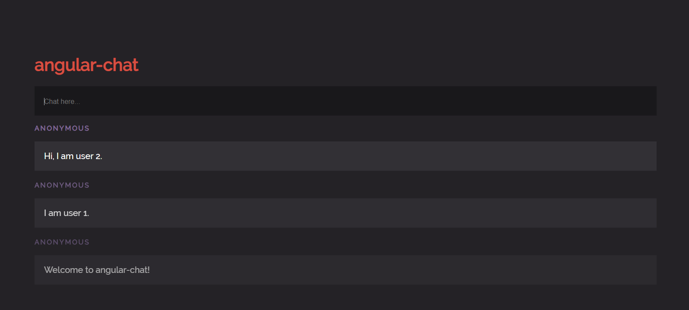

An Angular 2 Chat App using node.js.
# Hightlights:

## Use popular frameworks

1. Use Angular2, Socket.io, Webpack to develop Chat App.
2. Use SASS and PUG to speed up development.

## Clean code

Use helper functions like:

```js
const walkSync = (dir, fn1, fn2, minDepth, maxDepth) => {
  if (!Number.isInteger(maxDepth) || maxDepth >= 0) {
    if (fs.statSync(dir).isDirectory()) {
      fs.readdirSync(dir).map((f) => walkSync(path.join(dir, f), fn1, fn2, Number.isInteger(minDepth)? minDepth-1 : null, Number.isInteger(maxDepth)? maxDepth-1 : null));
      if (!Number.isInteger(minDepth) || minDepth <= 0) fn1(dir);
    }
    else if (!Number.isInteger(minDepth) || minDepth <= 0) fn2(dir);
  }
}
``` 

So recursive directory removal can be done with a one-liner:

```js
walkSync(path.join(__dirname, "intermediates"), (d) => fs.rmdirSync(d), (d) => fs.unlinkSync(d));
```

## Glue code

Instead of using webpack to load all the plugins, use simple code to handle the plugins for better control

```js
walkSync(path.join(__dirname, "src"), (d) => d, (d) => d.substr(d.length - 4) == ".pug" && fs.writeFileSync(path.join(__dirname, "public", path.parse(d).base.slice(0,-3) + "html"), Buffer.from(pug.renderFile(d))), null, 1);
```

## Demo
